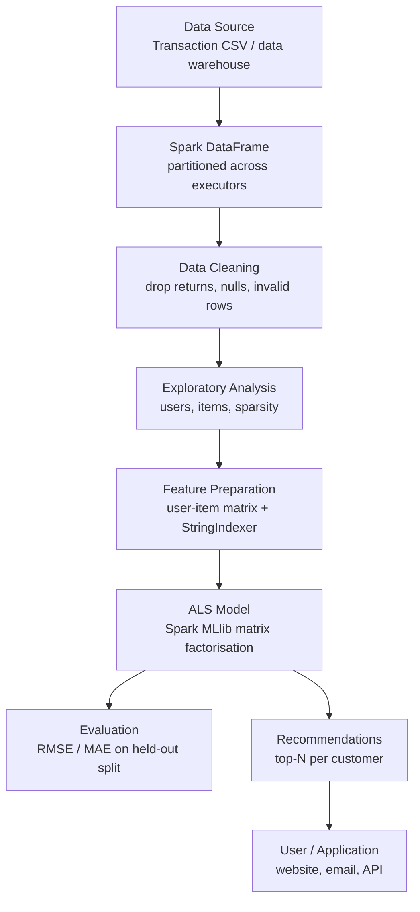

# E-Commerce Recommendation System Using Apache Spark

A distributed, end-to-end product recommendation pipeline built with **Python**
and **Apache Spark (PySpark)**, using **Spark MLlib's ALS** algorithm for
collaborative filtering on e-commerce transaction data.

Built for **Big Data Analytics – Assignment 10**.

📖 **Technical blog:** [`blog/ecommerce-recommendation-apache-spark.md`](blog/ecommerce-recommendation-apache-spark.md)
📊 **Dataset guide:** [`data/README.md`](data/README.md)
💻 **Implementation:** [`src/recommendation.py`](src/recommendation.py)

---

## Project Overview

Online retailers hold millions of transaction records. Buried in them is a
simple, valuable signal: *which customers like which products*. This project
extracts that signal and turns it into personalised product recommendations.

The pipeline reads raw transaction lines, cleans out the rows that are not
genuine purchases, derives an implicit interest score for every
customer-product pair, trains an ALS matrix-factorisation model on Spark
MLlib, evaluates it with RMSE, and produces a ranked top-N product list for
every customer.

Everything runs locally on a bundled sample file, and the **same script runs
unchanged on a cluster** against a million-row dataset — which is the point of
building it on Spark rather than pandas.

> **Honest scope statement.** The dataset committed here is a small,
> reproducible **synthetic** demo file (1,152 rows) that mirrors the schema of
> the real UCI *Online Retail II* dataset. It exists so the project runs
> immediately after cloning. This repository demonstrates a **scalable Big Data
> architecture** — it does **not** claim production-scale performance
> measurements, and no benchmark numbers from a real cluster are reported
> anywhere in this project. To get meaningful results, point the script at one
> of the real datasets listed in [`data/README.md`](data/README.md).

---

## Problem Statement

Given a large volume of historical e-commerce transactions, recommend to each
customer the products they are most likely to buy next.

The difficulty is one of scale. For a retailer with 500,000 customers and
50,000 products, the conceptual user–item matrix holds **25 billion cells**
(~200 GB) and is more than **99.9% empty**, because a typical shopper buys only
a handful of distinct products. A single-machine tool such as pandas runs out
of memory, and a naive O(n²) similarity comparison runs out of time. The
processing must therefore be **distributed** and must **exploit sparsity**.

---

## Objectives

1. Ingest e-commerce transaction data into a distributed Spark DataFrame.
2. Clean invalid records — returns, cancellations, missing customer ids,
   zero-price adjustments and non-product lines.
3. Perform exploratory analysis to understand scale and sparsity.
4. Build a user–item interaction matrix from **implicit feedback** (purchase
   frequency and quantity), since e-commerce data has no star ratings.
5. Train a collaborative-filtering model using **Spark MLlib ALS**.
6. Evaluate the model with **RMSE** and **MAE** on a held-out split.
7. Generate and display **top-N recommendations** per customer, excluding
   products already purchased.
8. Keep the whole thing lightweight enough to run on a student laptop.

---

## Technologies Used

| Technology | Version | Role |
|-----------|---------|------|
| Python | 3.8+ (tested on 3.11) | Implementation language |
| Apache Spark / PySpark | 3.5+ (tested on 4.2.0) | Distributed processing engine |
| Spark SQL / DataFrames | — | Distributed tabular data structure |
| Spark MLlib | — | `ALS`, `StringIndexer`, `RegressionEvaluator` |
| NumPy | 1.24+ | Local linear algebra used by MLlib |
| Java (JDK) | 17 or 21 | Required runtime — Spark runs on the JVM |

---

## Architecture



**How Spark distributes this work.** The *Driver* (the process running
`recommendation.py`) builds a lazy execution plan. A *Cluster Manager* (YARN,
Kubernetes or Spark standalone) allocates machines. *Executors* hold DataFrame
partitions in memory and run tasks in parallel. Because Spark caches data in
memory between iterations, an iterative algorithm like ALS — which repeats the
same computation 10–20 times — is dramatically cheaper than it would be on
Hadoop MapReduce, which writes to disk after every stage.

---

## Dataset

**Bundled demo file:** [`data/sample_transactions.csv`](data/sample_transactions.csv)
— ~100 KB, 1,152 transaction lines, 80 customers, 40 products, plus five
deliberately invalid rows so the cleaning step visibly has work to do. This is
synthetic data generated to match the real schema, not real customer data.

**Recommended real dataset:** UCI **Online Retail II** — all transactions of a
UK-based online gift retailer from 01/12/2009 to 09/12/2011.
<https://archive.ics.uci.edu/dataset/502/online+retail+ii>

Alternatives (Retailrocket clickstream, MovieLens) and full download and
conversion instructions are in [`data/README.md`](data/README.md).

**Schema:** `InvoiceNo`, `StockCode`, `Description`, `Quantity`, `InvoiceDate`,
`UnitPrice`, `CustomerID`, `Country`.

---

## Project Structure

```
BDA/
├── README.md                                     # This file
├── requirements.txt                              # Python dependencies
├── .gitignore                                    # Excludes venvs, Spark output, big data files
├── blog/
│   └── ecommerce-recommendation-apache-spark.md  # 1,782-word technical blog
├── data/
│   ├── README.md                                 # Dataset guide + download links
│   └── sample_transactions.csv                   # Small reproducible demo file
└── src/
    └── recommendation.py                         # Complete PySpark ALS pipeline
```

---

## Installation

### Prerequisites

- **Python 3.8 or newer**
- **Java JDK 17 or 21** — Spark runs on the JVM and will not start without it.
  Verify with `java -version`. If it is missing, install Temurin/OpenJDK 17
  from <https://adoptium.net/>.
  (PySpark 3.5.x also accepts Java 8 and 11; PySpark 4.x requires 17 or 21.)

No separate Apache Spark installation is needed — the `pyspark` package ships
its own Spark distribution for local runs.

### Setup

```bash
# 1. Clone the repository
git clone https://github.com/Chetan-Katkar/BDA.git
cd BDA

# 2. Create a virtual environment
python -m venv venv
```

**Activate it — Windows (Command Prompt):**
```cmd
venv\Scripts\activate.bat
```

**Activate it — Windows (PowerShell):**
```powershell
venv\Scripts\Activate.ps1
```
> If PowerShell blocks the script, run once:
> `Set-ExecutionPolicy -Scope Process -ExecutionPolicy Bypass`

**Activate it — Linux / macOS:**
```bash
source venv/bin/activate
```

**Then install the dependencies:**
```bash
pip install --upgrade pip
pip install -r requirements.txt
```

---

## How to Run

### Simplest — uses the bundled sample data

```bash
python src/recommendation.py
```

That is the whole thing. It takes well under a minute.

> On **Windows**, use `python`. On many **Linux/macOS** systems the command is
> `python3`. Inside an activated virtual environment, `python` works everywhere.

### Useful options

```bash
# Recommend 10 products per customer instead of 5
python src/recommendation.py --top-n 10

# Run against the full real dataset (see data/README.md to obtain it)
python src/recommendation.py --data data/online_retail_II.csv --top-n 10

# Tune the ALS model
python src/recommendation.py --rank 20 --max-iter 20 --reg-param 0.05

# Use implicit-feedback ALS (treats scores as confidence weights)
python src/recommendation.py --implicit

# Save every customer's recommendations to CSV
python src/recommendation.py --save-recs output/recommendations

# Show all options
python src/recommendation.py --help
```

### Running on a real Spark cluster

The script is a normal PySpark application, so it can be submitted directly.
Remove or override the `.master("local[*]")` setting in
`create_spark_session()` and submit:

```bash
spark-submit --master yarn --deploy-mode client \
  --executor-memory 4G --num-executors 4 \
  src/recommendation.py --data hdfs:///data/online_retail_II.csv
```

No other code changes are required.

---

## Example Output

Real output from `python src/recommendation.py` on the bundled sample
(abbreviated):

```
========================================================================
E-COMMERCE RECOMMENDATION SYSTEM USING APACHE SPARK
========================================================================
Spark version : 4.2.0
Master        : local[*]

=== STEP 2: DATA CLEANING ===
Rows before cleaning : 1,152
Rows after cleaning  : 1,147  (removed 5)

=== STEP 3: EXPLORATORY DATA ANALYSIS ===
Transaction lines : 1,147
Unique customers  : 80
Unique products   : 40
Matrix density    : 35.84%

Top 10 products by total quantity sold:
+---------+---------------------------------+-------------+---------+
|StockCode|                      Description|TotalQuantity|Customers|
+---------+---------------------------------+-------------+---------+
|    22086|   PAPER CHAIN KIT 50'S CHRISTMAS|          485|       34|
|    22910|PAPER CHAIN KIT VINTAGE CHRISTMAS|          452|       29|
|    47566|                    PARTY BUNTING|          432|       33|
+---------+---------------------------------+-------------+---------+

=== STEP 5: TRAINING THE ALS MODEL ===
rank=10  maxIter=15  regParam=0.1  implicitPrefs=False
Model trained. User factors: 80, item factors: 40

=== STEP 6: EVALUATION ===
Scored test rows  : 152
RMSE              : 0.7961  (on the 1-5 interest scale)
MAE               : 0.5935

=== STEP 7: TOP-5 RECOMMENDATIONS PER CUSTOMER ===
--- Customer 17000 ---
Already purchased (top 5 by interest score):
+---------+---------+-------------+------+
|StockCode|Purchases|TotalQuantity|Rating|
+---------+---------+-------------+------+
|    22748|        3|           24|  3.59|
|    22622|        3|           21|  3.51|
|    22745|        2|           12|  2.64|
+---------+---------+-------------+------+

Recommended next (top 5, excluding items already bought):
+----------+----+---------+---------------------------------+------+
|CustomerID|rank|StockCode|                      Description| score|
+----------+----+---------+---------------------------------+------+
|     17000|   1|    22086|   PAPER CHAIN KIT 50'S CHRISTMAS|2.7091|
|     17000|   2|    22749|FELTCRAFT PRINCESS CHARLOTTE DOLL|2.4657|
|     17000|   3|    84879|    ASSORTED COLOUR BIRD ORNAMENT|2.3908|
|     17000|   4|    22910|PAPER CHAIN KIT VINTAGE CHRISTMAS|2.2804|
|     17000|   5|    84991|      60 TEATIME FAIRY CAKE CASES| 2.225|
+----------+----+---------+---------------------------------+------+

========================================================================
PIPELINE COMPLETE
========================================================================
```

Note that customer 17000's history is toys and children's items, and the model
— which was never told what a "toy" is — recommends another doll and related
party items. It learned that purely from the behaviour of similar customers.

---

## How the Recommendation System Works

**1. Load.** The CSV is read into a Spark DataFrame, partitioned across
executors. Column names from the two different Online Retail exports
(`Invoice`/`Price`/`Customer ID` vs `InvoiceNo`/`UnitPrice`/`CustomerID`) are
normalised automatically.

**2. Clean.** Rows that are not genuine purchases are removed:

| Rule | Why |
|------|-----|
| `CustomerID` is null/blank | No user to personalise for (guest or till sale) |
| `Quantity <= 0` | Returns and data errors, not purchases |
| `UnitPrice <= 0` | Free samples, write-offs, manual adjustments |
| `InvoiceNo` starts with `C` | Credit note / cancelled order |
| `StockCode` in `POST`, `M`, `DOT`, … | Postage and admin lines, not products |
| Exact duplicate rows | Double-counted interest |

**3. Build the interaction matrix.** E-commerce has **no star ratings**, so an
interest score is derived from behaviour — this is called **implicit
feedback**:

```
RawScore = log1p(TotalQuantity) + PurchaseCount
Rating   = min-max scaled into [1, 5]
```

`log1p` stops a single 500-unit bulk order from dominating the model, and the
1–5 scaling makes the RMSE easy to interpret.

**4. Index.** ALS requires numeric ids, so `StringIndexer` maps `CustomerID`
and `StockCode` to integers. The mapping is kept so recommendations can be
translated back into real product names.

**5. Train ALS.** ALS factorises the sparse user–item matrix **R** into two
small dense matrices, **R ≈ U × Vᵀ**, where each row of **U** is a customer's
taste vector and each row of **V** is a product vector (`rank` = 10 by
default). It alternates: fix **V** and solve for **U**, fix **U** and solve for
**V**. Each user's row solves independently of every other user's — that
independence is exactly what makes ALS parallelise across a cluster.

**6. Evaluate.** An 80/20 random split, scored with RMSE and MAE.
`coldStartStrategy="drop"` discards users or items that appear only in the test
split, which would otherwise produce `NaN` predictions and a `NaN` RMSE.

**7. Recommend.** `recommendForAllUsers` scores every customer against every
product from the learned factors. Products the customer has **already bought**
are then filtered out, and the top N remaining are returned.

---

## Big Data Concepts Demonstrated

| Concept | Where it appears |
|---------|------------------|
| **The 5 V's** (Volume, Velocity, Variety, Veracity, Value) | Discussed in the blog; Veracity handled by the cleaning stage |
| **Distributed processing** | `local[*]` uses all cores; `spark-submit --master yarn` uses a cluster |
| **Spark DataFrames** | Every transformation in `recommendation.py` |
| **Lazy evaluation** | Transformations build a plan; `count()` / `show()` trigger it |
| **Partitioning & shuffles** | `spark.sql.shuffle.partitions` tuned for demo size |
| **In-memory caching** | `.cache()` on the interaction matrix reused across ALS iterations |
| **Fault tolerance** | Lineage lets Spark recompute a lost partition, not the whole job |
| **Spark MLlib** | `ALS`, `StringIndexer`, `RegressionEvaluator` |
| **Collaborative filtering** | Recommendations from behaviour alone, no product metadata |
| **Matrix factorisation (ALS)** | `R ≈ U × Vᵀ` |
| **Sparsity** | Matrix density is reported during exploratory analysis |
| **Implicit feedback** | Interest score derived from purchase frequency + quantity |
| **Train/test evaluation** | 80/20 split, RMSE and MAE |
| **Cold start** | `coldStartStrategy="drop"`; discussed as a limitation |

---

## Results

Measured on the bundled 1,152-row sample with default parameters:

| Metric | Value |
|--------|-------|
| Transaction lines after cleaning | 1,147 (5 invalid rows removed) |
| Unique customers | 80 |
| Unique products | 40 |
| User–item pairs | 748 |
| Train / test rows | 596 / 152 |
| **RMSE** | **0.7961** (on the 1–5 interest scale) |
| **MAE** | **0.5935** |
| Recommendations generated | Top 5 for every customer |

An RMSE of ~0.80 on a 1–5 scale means predictions land on average within about
0.8 of the observed interest score. The recommendations are also qualitatively
sensible — customers with toy-heavy histories are shown toys.

**These figures are illustrative, not a benchmark.** With 80 customers they
confirm that the pipeline works end to end; they say nothing about performance
on a real dataset. Run against Online Retail II for meaningful numbers.

### Verification status

- ✅ `python -m py_compile src/recommendation.py` — passes.
- ✅ The full pipeline was **executed successfully** on PySpark **4.2.0** with
  **OpenJDK 21** on Linux. All output shown above is real program output, not
  illustrative text.
- ✅ Variants tested: default run, `--implicit`, `--top-n`, `--save-recs`, and
  the missing-file error path.
- ℹ️ Not tested on Windows or macOS, though the code uses no OS-specific paths
  (all paths are resolved with `os.path` relative to the script location).

---

## Limitations

- **Cold start.** A brand-new customer with no purchase history cannot be
  served by collaborative filtering. A production system falls back to
  popularity-based or content-based recommendations until enough signal exists.
- **Popularity bias.** Frequently purchased items are recommended more often,
  which can crowd out long-tail products.
- **Implicit feedback is ambiguous.** A purchase may be a gift or a mistake,
  and *not* buying something is not the same as disliking it.
- **RMSE is an imperfect metric here.** Users experience a ranked list, so
  precision@k or NDCG measure real quality better than a regression error.
- **Batch retraining only.** ALS is not incremental; models are rebuilt from
  scratch, typically nightly.
- **The demo dataset is small and synthetic.** Its 35.8% matrix density is far
  denser than real retail data, which is usually >99% sparse.
- **Local mode is not a cluster.** `local[*]` demonstrates the architecture but
  cannot show real distributed scaling.

---

## Future Scope

- **Hyperparameter tuning** with `CrossValidator` / `ParamGridBuilder` over
  `rank`, `regParam` and `maxIter`.
- **Ranking metrics** — precision@k and NDCG via `RankingEvaluator`.
- **Hybrid recommender** combining ALS with content-based similarity to solve
  cold start.
- **Real-time scoring** using Spark Structured Streaming over the live
  clickstream.
- **Weighted event types** — treat view < add-to-cart < purchase as
  progressively stronger signals (suits the Retailrocket dataset).
- **Time decay**, so recent purchases count more than old ones.
- **Serving layer** — precompute top-N nightly into Redis and expose a REST API.
- **Model persistence** with `model.save()` / `ALSModel.load()` to avoid
  retraining on every run.

---

## Authors

**Author 1:**
Chetan Katkar

**Author 2:**
[ADD PARTNER NAME]

> 📝 **Note:** Replace `[ADD PARTNER NAME]` with your partner's actual name in
> two files — this one (the Authors section above and the Contribution section
> below) and the header of
> `blog/ecommerce-recommendation-apache-spark.md`. To do it in one command:
>
> ```bash
> # Linux / macOS
> grep -rl "\[ADD PARTNER NAME\]" . --include="*.md" | xargs sed -i 's/\[ADD PARTNER NAME\]/Partner Name/g'
> ```

---

## Contribution

**Chetan Katkar:**
- Project implementation
- Spark/PySpark development
- Data processing
- Documentation

**[ADD PARTNER NAME]:**
- Research
- Dataset analysis
- Blog preparation
- Testing

Both authors jointly reviewed the final submission.

---

## References

1. Apache Spark — Official Documentation.
   <https://spark.apache.org/docs/latest/>
2. Apache Spark — Collaborative Filtering (ALS) Guide.
   <https://spark.apache.org/docs/latest/ml-collaborative-filtering.html>
3. Apache Spark — MLlib Machine Learning Guide.
   <https://spark.apache.org/docs/latest/ml-guide.html>
4. Apache Spark — Spark SQL and DataFrames Guide.
   <https://spark.apache.org/docs/latest/sql-programming-guide.html>
5. PySpark API Reference — `pyspark.ml.recommendation.ALS`.
   <https://spark.apache.org/docs/latest/api/python/reference/api/pyspark.ml.recommendation.ALS.html>
6. Apache Spark — Cluster Mode Overview.
   <https://spark.apache.org/docs/latest/cluster-overview.html>
7. Chen, D. *Online Retail II* [Dataset]. UCI Machine Learning Repository, 2019.
   <https://archive.ics.uci.edu/dataset/502/online+retail+ii>
8. Retailrocket recommender system dataset. Kaggle.
   <https://www.kaggle.com/datasets/retailrocket/ecommerce-dataset>
9. Hu, Y., Koren, Y., & Volinsky, C. "Collaborative Filtering for Implicit
   Feedback Datasets." *IEEE International Conference on Data Mining (ICDM)*,
   2008, pp. 263–272. — the basis of Spark's `implicitPrefs` option.
10. Koren, Y., Bell, R., & Volinsky, C. "Matrix Factorization Techniques for
    Recommender Systems." *IEEE Computer*, vol. 42, no. 8, 2009, pp. 30–37.
11. Zaharia, M. et al. "Apache Spark: A Unified Engine for Big Data
    Processing." *Communications of the ACM*, vol. 59, no. 11, 2016, pp. 56–65.
12. Harper, F. M., & Konstan, J. A. "The MovieLens Datasets: History and
    Context." *ACM Transactions on Interactive Intelligent Systems*, vol. 5,
    no. 4, 2015. <https://grouplens.org/datasets/movielens/>

---

*Big Data Analytics — Assignment 10*
