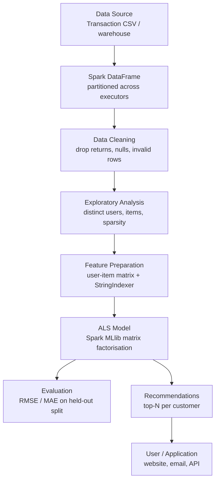

# Building an E-Commerce Recommendation System Using Apache Spark

> *Technical blog prepared for Big Data Analytics Assignment 10.*
> Publication-ready for Medium, Hashnode or LinkedIn; not yet published.

**Authors:** Chetan Katkar and [ADD PARTNER NAME]
**Code:** <https://github.com/Chetan-Katkar/BDA>

---

## Abstract

Every time an online store shows "Customers who bought this also bought…", a
recommendation engine is running behind it. Doing this for a few customers is
easy; doing it for millions of shoppers and hundreds of thousands of products
is a Big Data problem — the data stops fitting in one machine's memory and the
arithmetic stops finishing on one CPU.

This article walks through a working solution using **Apache Spark** and
**MLlib**, building a collaborative-filtering recommender with the **ALS
(Alternating Least Squares)** algorithm. The code runs on a laptop in under a
minute against a small bundled sample, and unchanged on a cluster against a
million-row dataset. That portability is the argument for Spark.

---

## The Big Data Problem

Consider a retailer with 500,000 customers and 50,000 products. To recommend
anything we need a **user–item matrix**: one row per customer, one column per
product, each cell holding that customer's interest in that product. That is
**25 billion cells** — roughly 200 GB as 8-byte numbers, far beyond a normal
machine's RAM.

The saving grace is **sparsity**. A typical shopper buys maybe 20 distinct
products ever, so 20 of 50,000 columns are filled. The matrix is over 99.9%
empty: the useful information is tiny, and the empty space makes it
unmanageable.

This fits the classic **"V"s of Big Data**:

- **Volume** — years of transaction logs run to hundreds of millions of rows.
- **Velocity** — clicks, carts and orders arrive continuously.
- **Variety** — purchases, views, wishlists, returns and reviews are all
  signals about the same preference.
- **Veracity** — real exports are dirty: cancellations, missing ids, postage
  lines, bulk outliers, £0.00 adjustments.
- **Value** — recommendations drive revenue, which is why this gets solved.

---

## Why Traditional Recommendation Processing Becomes Difficult

The obvious first attempt — a pandas script that loads the CSV and compares
customers — works beautifully at 10,000 rows, then fails for three reasons.

**Memory.** pandas loads everything into one process's RAM. Past a few
gigabytes you hit a `MemoryError`, with no way out: it cannot spill to disk or
split across machines.

**Single-CPU computation.** Naive user-to-user similarity is O(n²) — 125
billion comparisons on one core for 500,000 customers, over a day even at a
million per second.

**No fault tolerance.** A four-hour job that dies at hour three produces
nothing.

**Hadoop MapReduce** distributes the work but writes intermediate results to
disk after every stage. Machine learning is *iterative* — ALS repeats the same
computation 10 to 20 times — so MapReduce re-reads the whole dataset from disk
each iteration. Correct, but painfully slow.

---

## Why Apache Spark?

Spark exists to fix that weakness: it keeps working data **in the cluster's
memory across iterations** instead of round-tripping to disk. For an algorithm
that passes over the same data fifteen times, that matters.

Its architecture has three parts:

- The **Driver** runs your program, builds the execution plan and schedules
  work — the process running `recommendation.py`.
- The **Cluster Manager** (YARN, Kubernetes or Spark standalone) hands out
  machines.
- The **Executors** are workers on those machines, holding data partitions in
  memory and running tasks in parallel.

Two more properties matter. Execution is **lazy**: `filter` and `groupBy` only
build a plan, and nothing runs until an *action* like `count()` demands a
result, letting the Catalyst optimiser rewrite the chain first. And Spark
tracks each partition's **lineage**, so a dead executor costs one recomputed
partition, not the job.

We work with **Spark DataFrames**: distributed tables split into partitions
across executors, with a known schema. They resemble pandas DataFrames, but
`df.filter(...)` means "run this in parallel on every partition on every
machine", not "scan an array in memory".

---

## Architecture



---

## Dataset

The project uses the schema of the **UCI Online Retail II** dataset: all
transactions of a UK-based online gift retailer between December 2009 and
December 2011, with columns `InvoiceNo`, `StockCode`, `Description`,
`Quantity`, `InvoiceDate`, `UnitPrice`, `CustomerID` and `Country`.

To keep the repository small and runnable straight after cloning, we commit only
a ~100 KB synthetic sample with the identical schema — 1,152 transaction lines,
80 customers, 40 products, plus a few deliberately broken rows.
`data/README.md` links the real dataset, which the script reads unchanged.


To be explicit: **the bundled demo is a small reproducible example, not a
production-scale benchmark.** Nothing here claims cluster performance numbers;
it shows the *architecture* and the *method*, both of which scale.

---

## Data Processing Pipeline

Real retail data is messy, and a recommender trained on it learns nonsense.
Four cleaning rules matter most. Drop rows with:

- **No `CustomerID`** — guest or till sales, with no user to personalise for.
- **Negative quantities or a `C`-prefixed invoice** — returns and
  cancellations, evidence *against* a preference.
- **Zero or negative prices** — samples, write-offs, adjustments.
- **Non-product codes** like `POST` and `M`. Nobody wants postage recommended.

Then comes what makes e-commerce different from movie ratings: **there are no
star ratings.** Nobody rates a lunch bag out of five; we only observe
behaviour. This is **implicit feedback**, and we derive an interest score from
it:

```python
interactions = (
    df.groupBy("CustomerID", "StockCode")
      .agg(F.sum("Quantity").alias("TotalQuantity"),
           F.count(F.lit(1)).alias("Purchases"))
      .withColumn("RawScore",
                  F.log1p(F.col("TotalQuantity")) + F.col("Purchases"))
)
```

Two signals combine: how many separate times the product was bought, and how
many units in total. `log1p` compresses the quantity so one bulk order cannot
dominate, and the result is scaled into a familiar 1–5 range.

---

## Collaborative Filtering with ALS

**Collaborative filtering** rests on one assumption: people who agreed before
will agree again. If you and I both bought a jam-making set and a recipe box,
and I also bought a cake stand, that cake stand is a reasonable suggestion for
you. This needs no knowledge of what the products *are* — only the pattern of
who bought what.

ALS implements this by **matrix factorisation**. It approximates the huge
sparse matrix **R** (users × items) as the product of two small dense matrices:

> **R ≈ U × Vᵀ**

where **U** is users × *k* and **V** is items × *k*, with *k* (the `rank`)
typically 10–100. Each row of **U** describes a customer's taste, each row of
**V** a product. Their dot product predicts interest — including for pairs
never observed, which is where new recommendations come from.

Solving both at once is non-convex and hard. ALS sidesteps this by
**alternating**: fix **V**, solve for **U**; fix **U**, solve for **V**;
repeat. Each half is ordinary least squares, and — the key point — each user's
row solves **independently of every other user's**. That independence is what
lets ALS parallelise cleanly across a cluster, and why MLlib ships it.

---

## Implementation

The whole model is about fifteen lines:

```python
als = ALS(
    userCol="userIndex", itemCol="itemIndex", ratingCol="Rating",
    rank=10,               # latent factors per user/item
    maxIter=15,            # ALS alternations
    regParam=0.1,          # L2 regularisation against overfitting
    implicitPrefs=False,   # True -> treat scores as confidence weights
    coldStartStrategy="drop",
    nonnegative=True, seed=42,
)
model = als.fit(train)
```

Two details matter. ALS needs **numeric** ids, so `StringIndexer` maps codes
like `85123A` to integers and we keep the mapping to translate results back.
And `coldStartStrategy="drop"` handles users or items appearing only in the
test split — without it ALS emits `NaN` predictions, and the RMSE is `NaN` too.

Generating recommendations is one call plus one filter:

```python
candidates = model.recommendForAllUsers(n)
# remove products the customer has already bought
candidates = candidates.join(owned, on=["userIndex", "itemIndex"], how="left_anti")
```

Recommending something already in the order history is arithmetically correct
and commercially useless, so we exclude it.

---

## Results / Sample Output

Running against the bundled sample:

```
Unique customers  : 80
Unique products   : 40
RMSE              : 0.7961  (on the 1-5 interest scale)
MAE               : 0.5935

--- Customer 17000 ---
Already purchased : POPPY'S PLAYHOUSE KITCHEN, BOX OF VINTAGE ALPHABET BLOCKS,
                    POPPY'S PLAYHOUSE BEDROOM ...
Recommended next:
+------+---------------------------------+------+
| rank |           Description           | score|
+------+---------------------------------+------+
|   1  | PAPER CHAIN KIT 50'S CHRISTMAS  |2.7091|
|   2  | FELTCRAFT PRINCESS CHARLOTTE DOLL|2.4657|
|   3  | ASSORTED COLOUR BIRD ORNAMENT   |2.3908|
+------+---------------------------------+------+
```

RMSE of 0.80 on a 1–5 scale means predictions land on average within about 0.8
of the observed score. The output is also *sensible*: this customer's history
is toys and children's items, and the model — never told what a "toy" is —
surfaces another doll. With 80 customers these numbers are illustrative rather
than a benchmark; they confirm the pipeline works.

---

## Advantages

- **Scales horizontally** — the same code runs on a laptop or 100 machines.
- **Needs no product metadata** — behaviour alone suffices, so it works on
  catalogues with no categories.
- **Finds non-obvious links** no category tree encodes.
- **Fault tolerant** — a dead executor costs a partition, not the job.
- **Handles sparsity by design** — factorisation compresses a 99.9% empty
  matrix into small dense vectors.

## Limitations

- **Cold start.** A new customer has no history, so real systems fall back to
  popularity rules until enough signal accumulates.
- **Popularity bias** crowds out the long tail.
- **Implicit feedback is ambiguous** — a purchase may be a gift or a mistake,
  and not buying is not disliking.
- **RMSE is strictly the wrong metric.** Users see a ranked list, so
  precision@k or NDCG reflect quality better.
- **Retraining is batch** — ALS is not incremental; models rebuild nightly.

---

## Real-World Applications

The pattern generalises far beyond retail: "frequently bought together" panels,
streaming home-page ranking, music playlists, marketplace search ranking and
e-mail campaigns — all the same user–item–interaction shape, differing only in
what counts as an interaction.

## Future Improvements

- **Hyperparameter tuning** with `CrossValidator` over `rank` and `regParam`.
- **Ranking metrics** (precision@k, NDCG) via `RankingEvaluator`.
- **A hybrid model** pairing ALS with content-based similarity.
- **Near-real-time scoring** with Structured Streaming on the clickstream.
- **Weighted event types** (view < add-to-cart < purchase) and **time decay**.
- **A serving layer** — top-N precomputed nightly into Redis behind an API.

---

## Conclusion

Recommendation at scale is a genuine Big Data problem: the user–item matrix is
enormous, overwhelmingly empty, and the algorithm that makes sense of it is
iterative. Spark answers all three — DataFrames partition the data, in-memory
caching makes iteration affordable, and MLlib's ALS turns a sparse matrix into
compact taste vectors predicting what someone wants next.

The most instructive part is how little the code changes between scales. The
script processes 1,152 rows on a laptop; pointed at a million-row file with
`spark-submit --master yarn`, the logic is identical and Spark handles the
distribution. Writing one version of the code instead of one for small data and
one for big is the real skill Spark teaches.

---

## References

1. Apache Spark — Official Documentation. <https://spark.apache.org/docs/latest/>
2. Apache Spark — Collaborative Filtering (ALS) Guide.
   <https://spark.apache.org/docs/latest/ml-collaborative-filtering.html>
3. Apache Spark — MLlib Guide. <https://spark.apache.org/docs/latest/ml-guide.html>
4. Apache Spark — Spark SQL and DataFrames Guide.
   <https://spark.apache.org/docs/latest/sql-programming-guide.html>
5. PySpark API — `pyspark.ml.recommendation.ALS`.
   <https://spark.apache.org/docs/latest/api/python/reference/api/pyspark.ml.recommendation.ALS.html>
6. Chen, D. *Online Retail II* [Dataset]. UCI Machine Learning Repository, 2019.
   <https://archive.ics.uci.edu/dataset/502/online+retail+ii>
7. Hu, Y., Koren, Y., & Volinsky, C. "Collaborative Filtering for Implicit
   Feedback Datasets." *IEEE ICDM*, 2008, pp. 263–272 — the basis of Spark's
   `implicitPrefs` option.
8. Koren, Y., Bell, R., & Volinsky, C. "Matrix Factorization Techniques for
   Recommender Systems." *IEEE Computer*, 42(8), 2009, pp. 30–37.
9. Zaharia, M. et al. "Apache Spark: A Unified Engine for Big Data
   Processing." *CACM*, 59(11), 2016, pp. 56–65.
